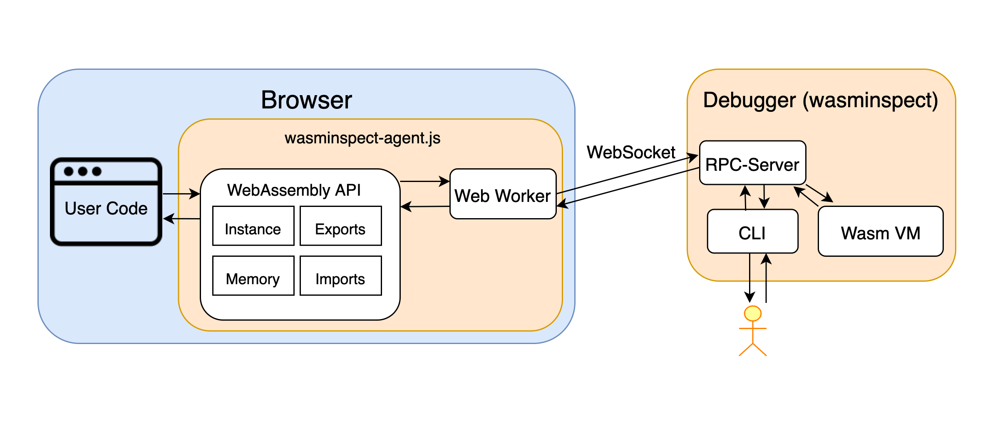

# wasminspect-agent.js

A debugger agent of [wasminspect](https://github.com/kateinoigakukun/wasminspect) for JavaScript host environment.
This libray is compatible for both browser and Node.js.


## Usage

`WasmInspect.init` replaces all WebAssembly APIs to communicate with debugger server, so you don't need to do other special things.

```javascript
const { WasmInspect } = require("wasminspect-agent.js");

(async () => {
  const response = await fetch("/fib.wasm");
  const responseArrayBuffer = await response.arrayBuffer();
  const wasmBytes = new Uint8Array(responseArrayBuffer).buffer;

  /// Prepare for debugger
  WasmInspect.init(window); // Replace WasmInspect.init(global); for Node.js
  WasmInspect.configuration.blockingTimeout = 5 * 60 * 1000;

  const { instance } = await WebAssembly.instantiate(wasmBytes, {
    js_env: {
      print: (n) => {
        console.log(n);
      }
    }
  });
  instance.exports.fib(4)
})()

```

## Architecture


